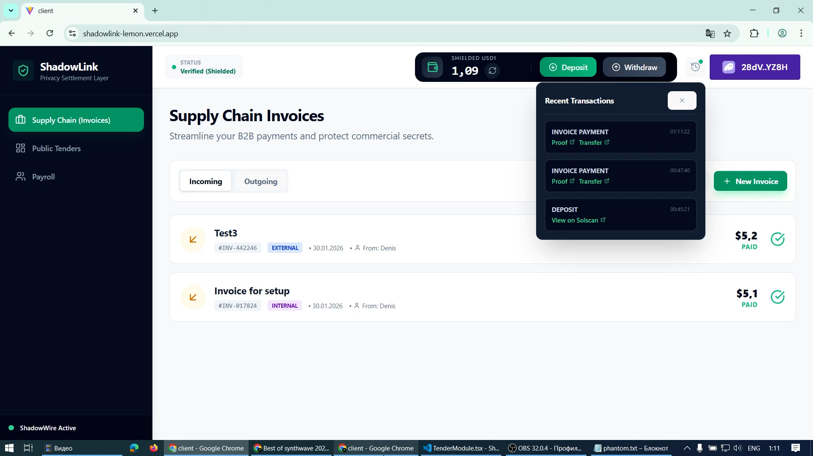

# 🛡️ ShadowLink

> **Privacy-First Settlement Layer for Business on Solana.**

> Built with **ShadowWire SDK**, NestJS, React, and MongoDB.

<div align="center">

[](https://shadowlink-lemon.vercel.app)

[](https://youtu.be/9btKsPJJRuM)

<p align="center">
  
  
  
  
</p>
</div>

---

## 📽️ Demo Showcase

<!-- Замени VIDEO_ID на ID твоего видео на YouTube или вставь картинку-ссылку на Loom -->
<div align="center">
  <a href="https://youtu.be/9btKsPJJRuM">
    
    <br>
    <i>Click to watch the full walkthrough demonstrating Mainnet transactions</i>
  </a>
</div>

---

## 💡 The Problem & Solution

Businesses need privacy, but Blockchains are public.
*   **Competitors** can see how much you pay suppliers.
*   **Employees** can see each other's salaries.
*   **Bidders** can see rival offers in tenders.

**ShadowLink** is a comprehensive B2B platform enabling confidential transactions for public procurement, supply chain invoices, and corporate payroll using Zero-Knowledge Proofs (Bulletproofs) on Solana Mainnet.

---

## 🚀 Key Features

### 1. 🏛️ ShadowTender (Public Procurement)
- **Blind Bidding:** Companies submit encrypted bids. Competitors cannot see amounts, preventing bid sniping and collusion.
- **Workflow:** Create Tender → Deposit & Bid → Select Winner → Submit Work → Private Payment.
- **Verification:** ZK-Proofs ensure the bid is valid without revealing the value on-chain.

### 2. 📦 SupplyChain Zero (Invoicing)
- **Private B2B Payments:** Suppliers issue invoices; buyers pay using **USD1** via ShadowWire.
- **Address Book:** Manage verified business contacts.
- **Flexible Settlement:** Choose between **Internal** (Shielded-to-Shielded) or **External** (Shielded-to-Public) transfers.

### 3. 👥 ShadowPayroll (Corporate Salaries)
- **Batch Processing:** Pay salaries to hundreds of employees with privacy.
- **Salary Confidentiality:** Employees receive funds, but the amount is hidden from on-chain observers and colleagues.

---

## 🛠️ Tech Stack

- **Blockchain:** Solana (Mainnet), ShadowWire SDK v1.1.5 (WASM), USD1 Token.
- **Frontend:** React, Vite, Tailwind CSS, Lucide Icons, React Hot Toast.
- **Backend:** NestJS (Node.js), Mongoose.
- **Database:** MongoDB (Cloud Atlas).
- **Wallet:** Phantom (via Solana Wallet Adapter).

---

## ⚙️ Installation & Setup

### Prerequisites
- Node.js (v18+)
- MongoDB (Local or Atlas Connection String)
- Phantom Wallet (Solana Mainnet)

### 1. Clone Repository
```Bash
git clone https://github.com/denisthe12/shadowlink.git
cd shadowlink
```

### 2. Configure Environment Variables

Create `.env` files in both `client` and `server` directories.

**Server (`server/.env`):**
```env
MONGO_URI=mongodb://127.0.0.1:27017/shadowlink_db
PORT=3000
```

**Client (`client/.env`):**
```env
# Your Backend URL
VITE_API_URL=http://localhost:3000/api

# Solana RPC (Helius/QuickNode recommended for Mainnet)
VITE_RPC_URL=https://rpc.ankr.com/solana
```

### 3. Install Dependencies

**Backend:**
```Bash
cd server
npm install
```

**Frontend:**
```Bash
cd client
npm install
```

---

## 🏃‍♂️ Running the Project

You need to run both Backend and Frontend terminals.

### Terminal 1: Backend (NestJS)
```Bash
cd server
npm run start:dev
```
*Server will start on http://localhost:3000*

### Terminal 2: Frontend (Vite)
```Bash
cd client
npm run dev
```
*Client will start on http://localhost:5173*

---

## 🧪 Demo & Usage Guide

### 1. Connect Wallet
- Switch Phantom to **Mainnet Beta**.
- Ensure you have some **SOL** for gas and **USD1** tokens.

### 2. Deposit (Shielding Funds)
- Click **"Deposit"** in the header.
- Enter amount (min 5 USD1).
- Approve transaction. This moves funds into the **ShadowWire Shielded Pool**.

### 3. Creating a Private Invoice
- Go to **Supply Chain Invoices**.
- Click **New Invoice**.
- Select Contact (Bill To) and choose Type: **External** (or Internal if registered).
- Enter Amount and send.
- Switch user (or use another wallet) to Pay.
- Click **Pay Now**.
- **Result:** You will see a `tx_signature` proving the transaction was broadcasted to Solana Mainnet via the ShadowWire Relayer.

---

## 🏆 Hackathon Tracks

- **Best USD1 Integration:** Fully implemented USD1 as the primary settlement token.
- **Best Use Case:** Solves real-world privacy problems for B2B (Tenders, Payroll).

---

<div align="center">
  <sub>Built with ❤️ for Radr Labs Hackathon 2026</sub>
</div>